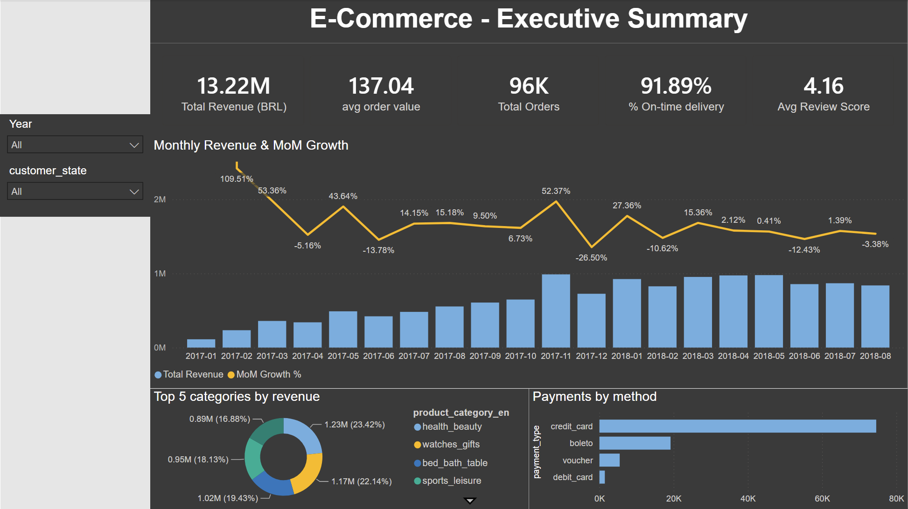
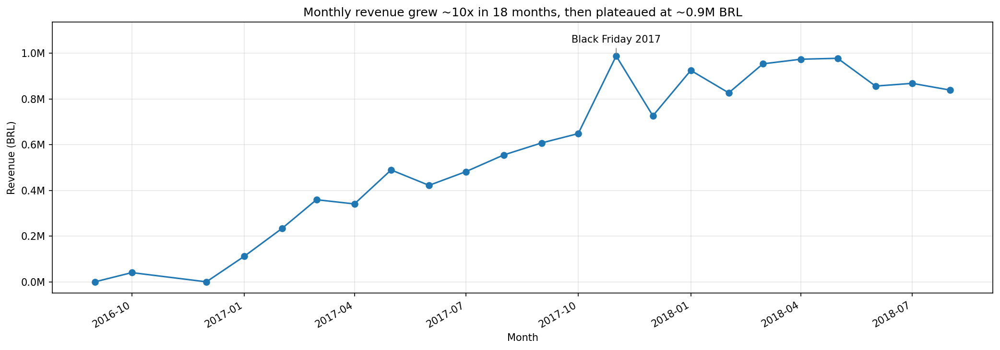
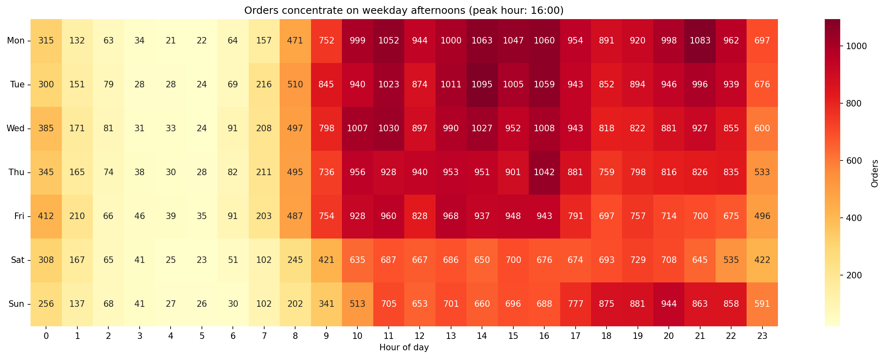
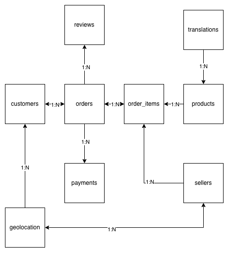

# Olist E-commerce Analysis — SQL, Python & Power BI

I analysed the Brazilian marketplace Olist: about 99,000 orders across 9 related tables,
2016 to 2018. I loaded the raw CSVs into SQLite, wrote the analysis in SQL and pandas, and
built a 3-page Power BI dashboard with recommendations that have measurable targets.

**The question I wanted to answer:** what drives revenue on this marketplace, and what
threatens its growth on the customer side and on the seller side?



*More dashboard pages: [Seller Performance](powerbi/screenshots/02_seller_performance.png) · [Customers & Delivery](powerbi/screenshots/03_customers_delivery.png)*

## Key findings

All metrics are computed on delivered orders: 96,478 out of 99,441, so 97% of the volume.
I explain that choice below, in "Metric definitions".

| Finding | Number |
|---|---|
| Total revenue / orders / AOV | 13.2M BRL / 96,478 / 137 BRL (median 87) |
| Revenue concentration (Pareto) | top 20% of sellers bring in **82.3%** of revenue |
| Customer retention | only **3.0%** of customers ever come back (1.03 orders per customer) |
| Delivery vs satisfaction | 7 days or less → **4.41★**, over 30 days → **2.18★**; things fall apart around **21 days** |
| Delivery geography | São Paulo 8.3 days, northern states 26 to 27 days, roughly **3× slower** |
| Problem sellers | **343 sellers (11.6%)** rated below 3.5★ |

**What it adds up to:** Olist is very good at acquiring customers and selling to them once.
Growth is bought rather than built. With retention at 3%, every unit of revenue needs new
marketing spend behind it. Service quality depends on two things the platform controls only
in part: delivery time and a long tail of weak sellers.

**Full analysis with quantified recommendations:** [docs/business_conclusions.md](docs/business_conclusions.md)

**Project presentation (8 slides):** [PDF](docs/olist_presentation.pdf) · [interactive version on Gamma](https://gamma.app/docs/Olist-E-Commerce-Marketplace-Analysis-xfld92snoqd23u2)

## Sample visualizations





## What cross-validation caught

I computed the main KPIs twice, in SQL and in DAX, and compared the results. That is how I
found four bugs in my own work. Two of them are worth describing, because there was no error
message. Nothing crashed. The two numbers were simply different:

**The Power BI dashboard showed 348 problem sellers, SQL said 343.** The DAX measure filtered
on `[Avg Review Score] < 3.5`, and in DAX a `BLANK()` compares as smaller than any number. Five
sellers with no reviews at all were being counted as poorly rated. Fixing it meant excluding
blanks explicitly: `NOT(ISBLANK([Avg Review Score])) && ...`.

**Average review score was 4.09 when it should have been 4.16.** I was computing satisfaction
across all reviews while every other metric used delivered orders only. Once I joined reviews
to delivered orders, the share of 5★ went from 57.8% to 59.2%, and 1–2★ dropped from 14.7% to
12.8%.

Both bugs taught me the same thing: I trust a number more when two tools give me the same
result than when one tool looks correct.

## Tech stack

- **SQL (SQLite)** — multi-table joins, window functions (`RANK`, `LAG`, `NTILE`), multi-CTE
  queries, cohort analysis, RFM segmentation
- **Python** — pandas for cleaning and KPIs, matplotlib and seaborn for charts
- **Power BI** — 3-page dashboard, DAX measures, data model over the cleaned tables
- **Excel Power Query** — an alternative cleaning pipeline, built to compare approaches

## Data model



## Project structure

```
portfolio-ecommerce/
├── data/                  # not in repo — see "How to reproduce"
│   ├── raw/               # 9 CSVs from Kaggle
│   ├── processed/         # cleaned CSVs (built by notebook 02)
│   └── olist.db           # SQLite database (built by notebooks 01–02)
├── notebooks/
│   ├── 01_import_data.ipynb      # CSV → SQLite
│   ├── 02_data_cleaning.ipynb    # types, dates, delivery_days, city typos, geo dedup
│   ├── 03_kpi_analysis.ipynb     # sales / logistics / satisfaction / retention KPIs
│   └── 04_visualizations.ipynb   # heatmap, boxplot, category ranking, revenue trend
├── sql/
│   ├── 01_eksploracja.sql             # data exploration
│   ├── 02_business_analysis.sql       # revenue trends, payments, logistics, retention
│   ├── 03_advanced_analysis.sql       # seller ranking, running totals, cohorts
│   └── 04_business_analysis_advanced.sql  # Pareto/ABC, SLA thresholds, problem sellers, RFM
├── powerbi/olist_dashboard.pbix
├── excel/olist_power_query.xlsx
├── docs/
│   ├── business_conclusions.md   # findings + recommendations
│   ├── erd_olist.drawio          # entity-relationship diagram (source)
│   ├── erd_olist.png             # entity-relationship diagram (export)
│   └── olist_presentation.pdf    # 8-slide project presentation
└── reports/                      # exported charts (PNG)
```

## How to reproduce

1. Download the dataset from Kaggle:
   [Brazilian E-Commerce Public Dataset by Olist](https://www.kaggle.com/datasets/olistbr/brazilian-ecommerce)
2. Put the 9 CSV files in `data/raw/`
3. Install dependencies: `pip install -r requirements.txt`
4. Run the notebooks in order, 01 through 04. Notebook 01 builds the SQLite database,
   02 cleans the data and rewrites the core tables
5. The SQL files in `sql/` run against `data/olist.db`, for example in DBeaver or the
   `sqlite3` CLI

## Metric definitions

I decided these before running the numbers, because every one of them changes the result.

- **Scope:** every KPI uses orders with status `delivered`. The one deliberate exception is
  the cancellation analysis, which by definition needs all statuses. Mixing the two is how the
  review-score bug above happened.
- **Revenue** = `SUM(order_items.price)`, so product value without freight. Freight is paid to
  carriers, not earned by sellers, and including it would inflate every revenue figure.
- **Seller rating** = average review score per order. One review counts as one vote, and
  reviews are not weighted by how many items a seller had in that order.
- **On-time delivery** = delivered date no later than the estimated delivery date.
- **Retention** = share of `customer_unique_id` with more than one delivered order.

## Known limitations

The data is historical (Brazil, 2016 to 2018), so the numbers describe that market and that
period, not e-commerce in general. There is no cost data — no CAC, no margins — which means
anything I say about profitability is directional rather than precise. Orders that involve
several sellers carry a single review, so a bad rating cannot always be attributed to the
seller who caused it. The full list is in
[docs/business_conclusions.md](docs/business_conclusions.md#5-ograniczenia-analizy).
